# API REST de Gestión de Productos - UTN Programación III

Este proyecto es el Trabajo Práctico Integrador para la materia Programación III de la Tecnicatura Universitaria en Programación (UTN).

**Alumno:** Franco Mellimaci

**Legajo:** 52698

---

## Descripción del Proyecto

Se desarrolló una API REST completa utilizando **Spring Boot** para la gestión de productos de un sistema de e-commerce básico.

La API implementa una **arquitectura en capas** (Controller, Service, Repository), persistencia de datos con **Spring Data JPA**, validaciones de entrada (`Bean Validation`), manejo global de excepciones (`@ControllerAdvice`) y documentación interactiva con **Swagger (OpenAPI)**.

## Tecnologías Utilizadas

* **Java 17**
* **Spring Boot 3.3.1** (para el framework base)
* **Maven** (para la gestión de dependencias)
* **Spring Web** (para los controladores REST)
* **Spring Data JPA** (para la persistencia de datos)
* **H2 Database** (como base de datos en memoria)
* **Spring Validation** (para validar DTOs)
* **Lombok** (para reducir código boilerplate)
* **Springdoc OpenAPI (Swagger)** (para la documentación de la API)

---

## ⚙️ Instrucciones para Clonar y Ejecutar

1.  **Clonar el repositorio:**
    ```bash
    git clone https://github.com/FMelli02/Programacion-III-UTN/tree/master/productos-api
    ```

2.  **Navegar al directorio:**
    ```bash
    cd productos-api
    ```

3.  **Ejecutar el proyecto:**
    El proyecto se puede ejecutar usando el wrapper de Maven:
    ```bash
    ./mvnw spring-boot:run
    ```
    O, alternativamente, ejecutando la clase principal `ProductosApiApplication.java` desde su IDE (IntelliJ, VSCode, etc.).

---

## Acceso a Herramientas

Una vez que la aplicación esté corriendo en `http://localhost:8080`, puede acceder a:

* **Documentación Swagger UI:**
  `http://localhost:8080/swagger-ui/index.html`

* **Consola H2 (Base de Datos):**
  `http://localhost:8080/h2-console`

  **Configuración para H2:**
    * **Driver Class:** `org.h2.Driver`
    * **JDBC URL:** `jdbc:h2:mem:testdb`
    * **User Name:** `sa`
    * **Password:** (Dejar en blanco)

---

## Tabla de Endpoints

La API expone los siguientes endpoints bajo la ruta base `/api/productos`:

| Método | Ruta | Descripción |
| :--- | :--- | :--- |
| `GET` | `/api/productos` | Lista todos los productos disponibles. |
| `GET` | `/api/productos/{id}` | Obtiene un producto específico por su ID. |
| `GET` | `/api/productos/categoria/{categoria}` | Filtra y lista productos por categoría. |
| `POST` | `/api/productos` | Crea un nuevo producto. |
| `PUT` | `/api/productos/{id}` | Actualiza un producto existente (completo). |
| `PATCH` | `/api/productos/{id}/stock` | Actualiza únicamente el stock de un producto. |
| `DELETE`| `/api/productos/{id}` | Elimina un producto por su ID. |

---

## Pruebas y Capturas de Pantalla

A continuación, se presentan las capturas de pantalla de las pruebas realizadas, como solicita la consigna del TP.

### 1. Documentación Completa en Swagger UI
Vista general de la interfaz de Swagger con todos los endpoints documentados:

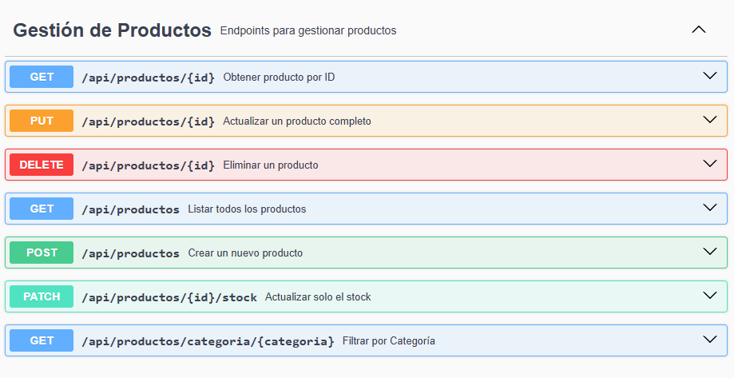

### 2. Prueba de Creación (POST 201)
Creación exitosa de un nuevo producto, retornando un código 201 (Created).

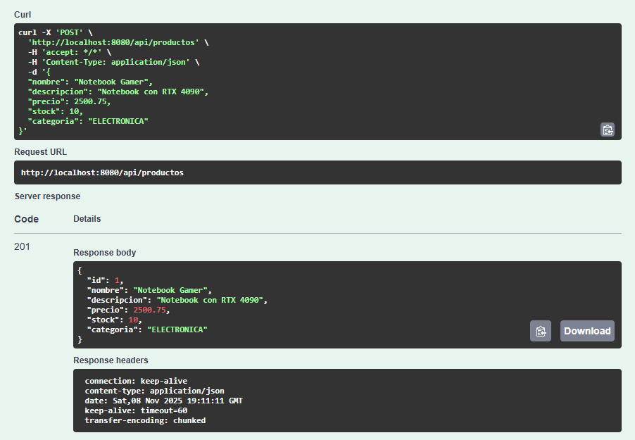

### 3. Error de Validación (POST 400)
Intento de crear un producto con datos inválidos (ej. nombre vacío o precio negativo). La API responde correctamente con un 400 (Bad Request).

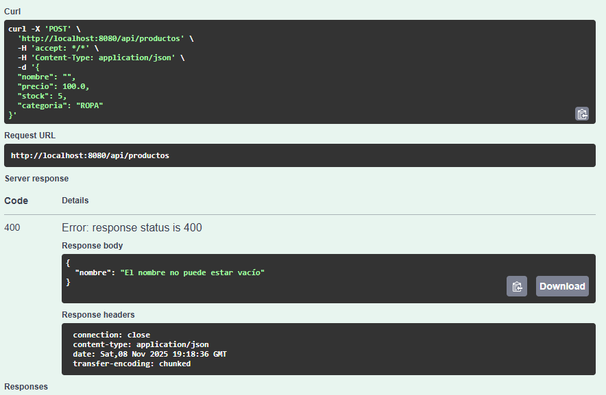

### 4. Prueba de Listado (GET 200)
Obtención de la lista completa de productos.

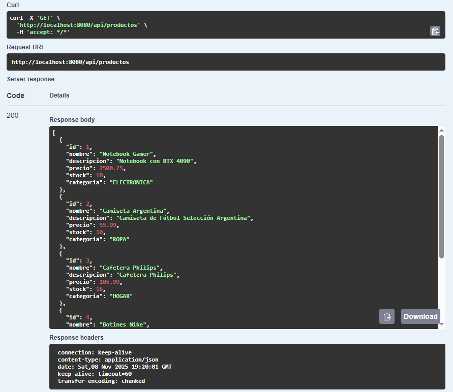

Obtención de categoría específica.

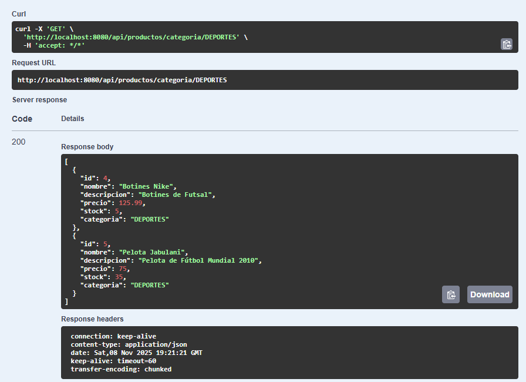

### 5. Obtener producto por ID
Filtro un producto por su ID.

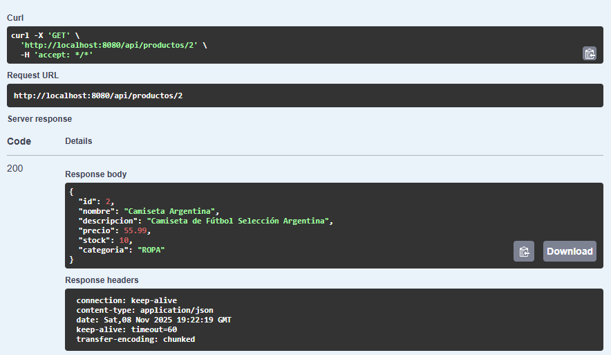

Intento de buscar un producto con un ID que no existe. La API responde correctamente con un 404 (Not Found) y un mensaje de error claro.

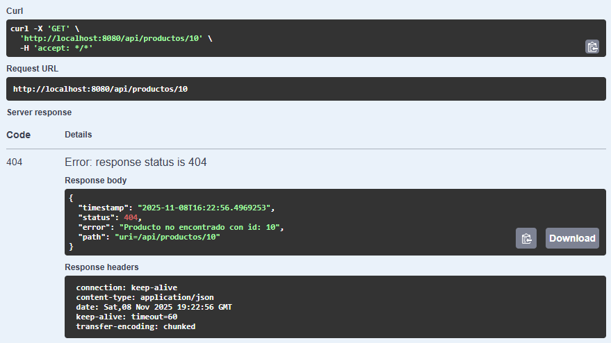

### 6. Actualizo un producto
Actualizo utilizando PUT.

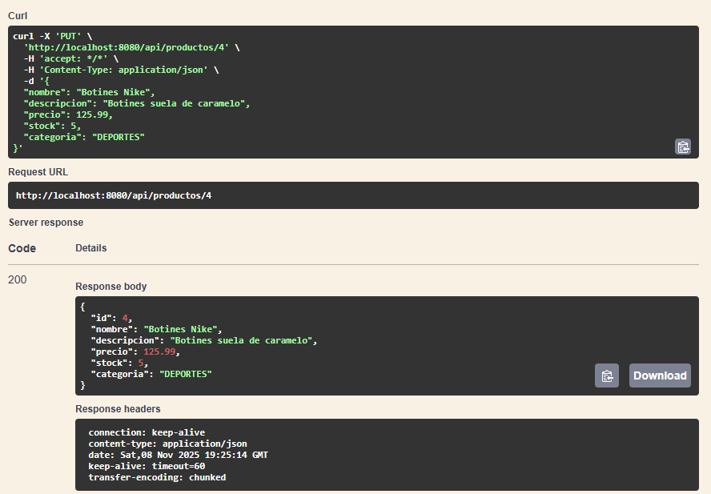

Actualizo utilizando PATCH.

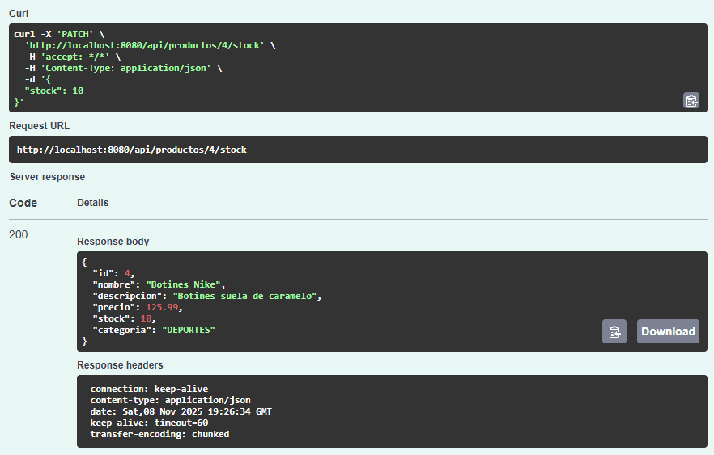

### 7. Elimino un producto
Elimino un producto por su ID.

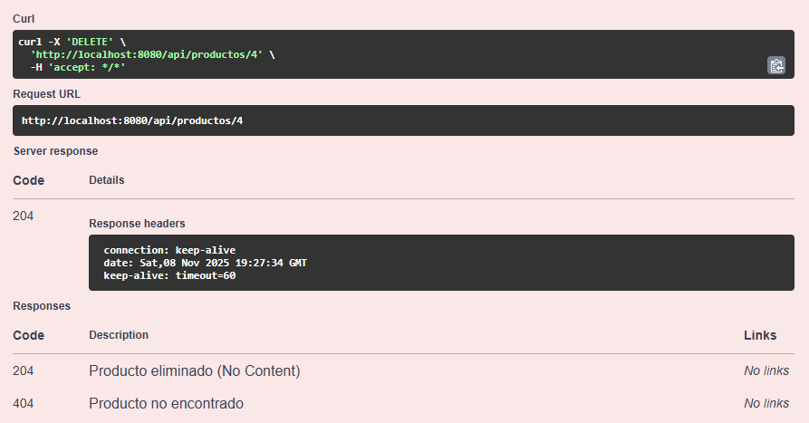

Intento obtener nuevamente el producto ya eliminado.

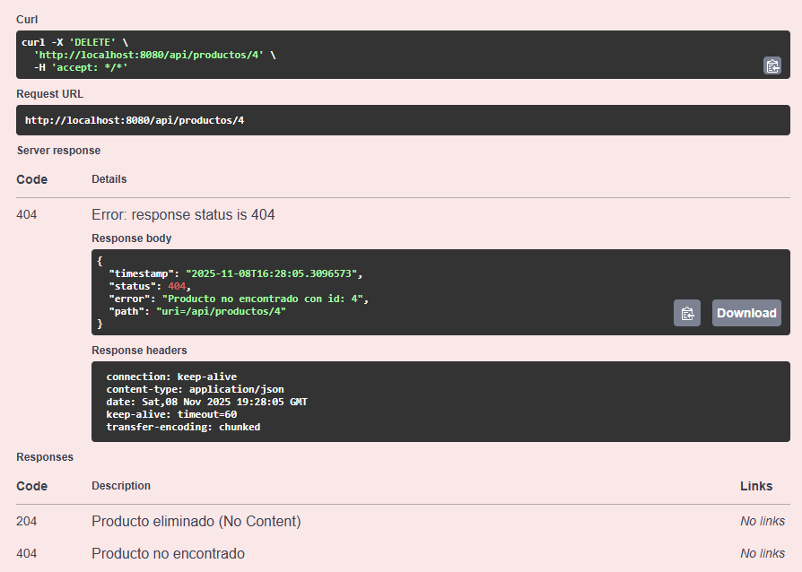

### 8. Consola H2 con Datos Persistidos
Verificación final en la consola H2 que muestra los productos persistidos correctamente en la base de datos en memoria.

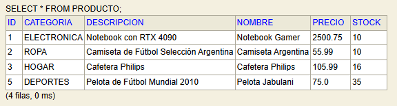

---

## Conclusiones Personales
La realización de este Trabajo Práctico me permitió aplicar y conectar todos los conceptos clave de la materia. Pude construir 
una API REST funcional desde cero, entendiendo la importancia de separar la lógica en capas (Controller, Service, Repository). 
Implementar DTOs para desacoplar el modelo de la base de datos y un manejo de excepciones global con @ControllerAdvice fueron los 
puntos más importantes para que el proyecto quede prolijo y profesional. Finalmente, documentar todo con Swagger me demostró lo fácil 
que es probar y exponer la API.