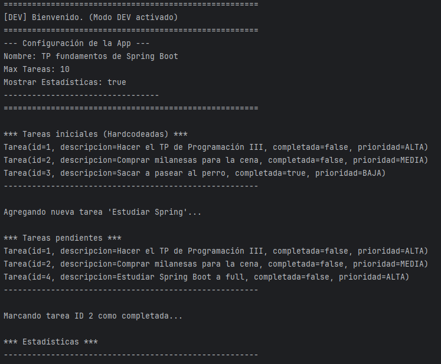
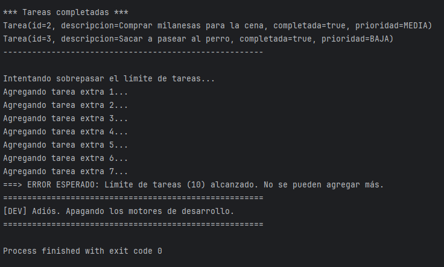
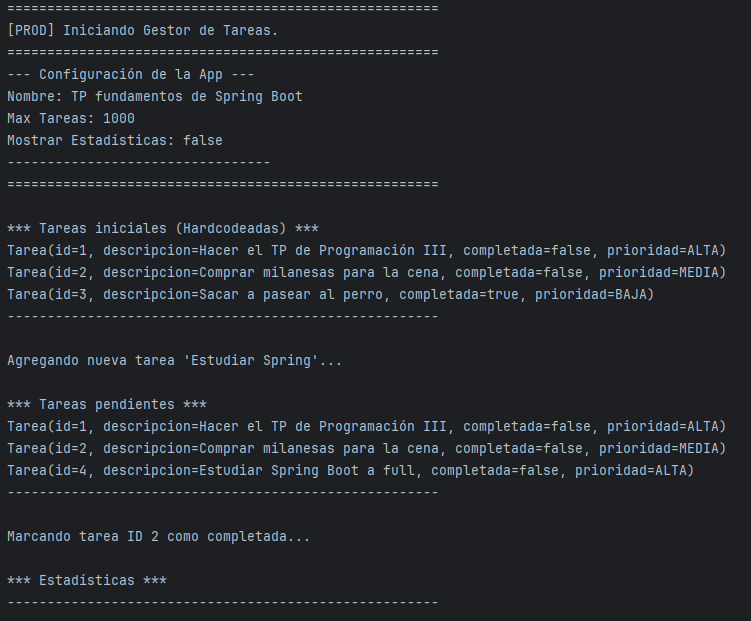
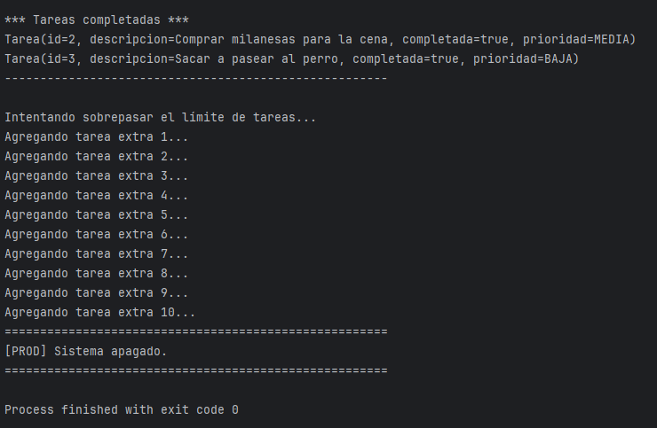

# Gestor de Tareas - Fundamentos de Spring Boot

Este proyecto es el Trabajo Práctico de la materia **Programación III** de la Tecnicatura Universitaria en Programación de la UTN.

El objetivo es construir una aplicación simple de gestión de tareas (To-Do List) para aplicar los conceptos fundamentales de **Spring Boot**.

-   **Alumno:** Franco Mellimaci
-   **Legajo:** 52698

---

## Descripción del Proyecto

La aplicación es un **CRUD** (Crear, Leer, Actualizar, Borrar) de tareas que funciona íntegramente en memoria, sin necesidad de una base de datos externa.

El foco principal del trabajo es demostrar el uso profesional de los siguientes pilares de Spring:

* **Inyección de Dependencias (IoC):** Se utiliza la inyección por constructor para desacoplar los componentes.
* **Estereotipos:** Se utilizan `@Service` para la lógica de negocio y `@Repository` para la capa de acceso a datos (simulada).
* **Configuración Externa (`.properties`):** La aplicación se configura usando archivos `application.properties`, inyectando valores con `@Value`.
* **Gestión de Perfiles (`@Profile`):** La aplicación tiene dos comportamientos distintos según el perfil activo (`dev` o `prod`), cargando configuraciones diferentes y beans condicionales.

---

## Tecnologías Utilizadas

* **Java 17**
* **Spring Boot 3.5.7**
* **Maven** (Gestor de dependencias)
* **Lombok** (Para reducir código boilerplate en modelos)

---

## Instrucciones para Clonar y Ejecutar

Para correr este proyecto en tu máquina local, seguí estos pasos:

**Pre-requisitos:**
* Tener instalado **Git**.
* Tener instalado **Java JDK 17** o superior.
* Tener instalado **Maven**.

**Pasos:**

1.  Cloná el repositorio:
    ```bash
    git clone https://github.com/FMelli02/Programacion-III-UTN/tree/master/tp-fundamentos-spring-boot
    ```

2.  Navegá al directorio del proyecto:
    ```bash
    cd tareas
    ```

3.  Ejecutá la aplicación usando el wrapper de Maven (recomendado):
    ```bash
    ./mvnw spring-boot:run
    ```
    (O si tenés Maven instalado globalmente: `mvn spring-boot:run`)

4.  La aplicación correrá en modo consola y ejecutará el flujo de pruebas definido en `TareasApplication.java`.

---

## Cómo Cambiar entre Perfiles (dev/prod)

Este proyecto utiliza perfiles de Spring para gestionar diferentes configuraciones. El perfil activo se define en el archivo:

`src/main/resources/application.properties`

Para cambiar el perfil, simplemente modificá la siguiente línea:

```properties
# Cambia "dev" por "prod" para activar el modo producción
spring.profiles.active=dev
```
* `spring.profiles.active=dev` (Desarrollo): 

    * Carga application-dev.properties. 

    * Límite máximo de tareas: 10 (ejemplo). 

    * Muestra estadísticas: true. 

    * Logging: DEBUG. 

    * Mensajes de bienvenida/despedida detallados (MensajeDevService).


* `spring.profiles.active=prod` (Producción): 

    * Carga application-prod.properties. 

    * Límite máximo de tareas: 1000 (ejemplo). 

    * Muestra estadísticas: false. 

    * Logging: ERROR. 

    * Mensajes de bienvenida/despedida simples (MensajeProdService).

---

## Capturas de Pantalla de la Consola

A continuación se muestran los resultados de la ejecución con ambos perfiles.

1. **Perfil `dev` (Desarrollo)**

    En esta ejecución se observa el saludo de bienvenida de desarrollo, el nivel de log en `DEBUG`, la configuración de `max-tareas` baja (ej. 10) y el comportamiento correspondiente (ej. estadísticas visibles).

    
    

2. Perfil `prod` (Producción)
   En esta ejecución se observa el saludo conciso de producción, el log limpio (solo `ERROR`), la configuración de `max-tareas` alta (ej. 1000) y las estadísticas desactivadas.

   
   

---

## Conclusiones Personales

La verdad, este TP me sirvió para bajar a tierra los conceptos fundamentales de Spring Boot que capaz en la teoría quedan en el aire.

Lo mejor fue entender de verdad la **Inyección de Dependencias (IoC)**. Al principio parecía más complicado, pero cuando tenés el `TareaService` pidiéndole el `TareaRepository` por el constructor y Spring se encarga de crearlo e inyectarlo solo... te das cuenta de que te ahorra un quilombo. Deja el código más limpio, desacoplado y fácil de probar.

Algo que me pareció bastante interesante, es lo de los **Perfiles (`@Profile`)**. Te saca la idea de "hardcodear" valores y te obliga a pensar la configuración para distintos ambientes.